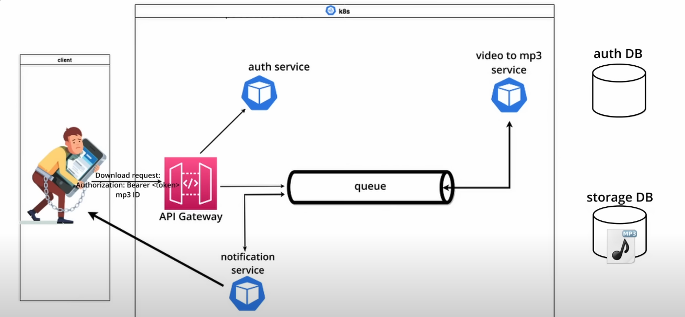

Video to MP3 converter microservice

### Services 
- Authetication 
- Converter
- Notification
  

### TechStack
- Flask
- RabbitMQ
- Kubernetes
- MySQL (Auth DB)
- MongoDB (Storage DB)
 
 

### Conversion flows 
1. Client updload a video and send a conversion request to the gateway
2. The video is saved in MongoDB and the conversion is put in a queue
3. The converter service converts the video to mp3 and stores it in MongoDB
4. A messagge is added to the queue to notify that the file is ready
5. The notification service consume the message and sends and email to the client
6. The client uses the id in the email to retrive the mp3 through the gateway

 

  

### Kubernetes Cluster Configuration
Auth Service: 
- Deployment
- ConfigMap
- Secret
- Service

Gateway: 
- Deployment
- Service
- Ingress
- ConfigMap
- Secret

Converter Service:
- Deployment
- ConfigMap
- Secret
- Service

RabbitMQ:
- StatefulSet
- Service
- Ingress
- Volume claim

MySQL:
- StatefulSet
- Service
- Configmap
- Secret 
- Volume claim

MongoDB: 
- StatefulSet
- Service
- Configmap
- Secret 
- Volume claim